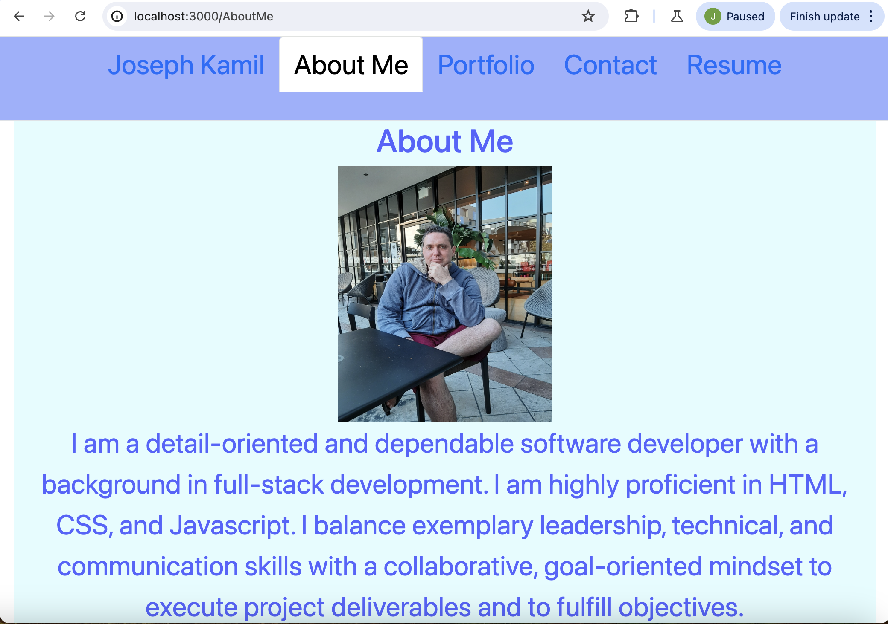

# React Portfolio

## Description

a portfolio using your new React skills, which will help set you apart from other developers whose portfolios don’t use the latest technologies.

## Table of Contents

- [Installation](#installation)
- [Usage](#usage)
- [License](#license)
- [Contributing](#contributing)
- [Tests](#tests)
- [Questions](#questions)

## Installation

npm i, npm dev start

## Usage

none

## license

      This project is licensed under none

## Contributing

none

## Tests

## Questions

For any questions, please contact [kamilj62](https://github.com/kamilj62) on GitHub or email at kamilj@umich.edu.
